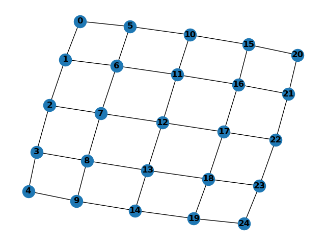
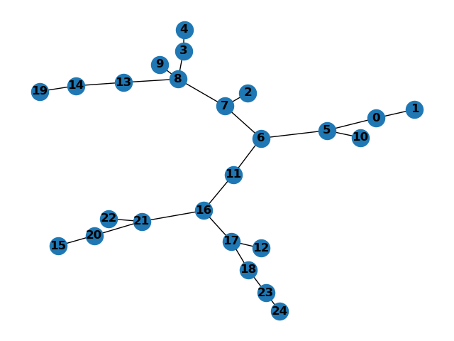

# Dokumentacja

## Plik `Partition.py`
W pliku `Partition.py` znajduje się jedna klasa o nazwie `Partition`, omówmy sobie po krótce co robi każda z jej metod. Może jeszcze zanim to idea samej klasy. Jest implementacją idei partycji, czyli grupy rozłącznych ze sobą zbiorów. Złączenie wszystkich zbiorów partycji, daję nam jakby całe uniwersum, na którym pracujemy. W algorytmie Kruskala, uniwersum w partycji, to będą wszystkie wierzchołki grafu. O samym działaniu algorytmu później.

- `__init__`: metoda odpowiedzialna za tworzenie tablicy ze zbiorami jednoelementowymi. Wszystkie te zbiory są ze sobą rozłączne. Ustawiamy także, rozmiar maksymalny naszego zbioru, czyli `universe_size`.
    ```python
    def __init__(self, n):
        self.particies = [{i} for i in range(n)]
        self.universe_size = n
    ```
- `__str__` i `__len__` i `size`: metody pomocnicze, wyświetlają odpowiednio tablicę z zbiorami w formie str, oraz len zwraca nam rozmiar uniwersum, na którym pracujemy. size zwraca nam długość wektora partycji, czyli ich ilość.
    ```python
    def __str__(self):
        return str(self.particies)

    def __len__(self):
        return self.universe_size
  
    def size(self):
        return len(self.particies)
    ```

- `get_partitions`: zwraca nam tablicę z partycjami
    ```python
    def get_partitions(self):
        return self.particies
    ```
- `find_set`: przeszukuje zbiory w celu znalezienia, tego, w którym znajduje się wierzchołek
    ```python
    def find_set(self, vertex):
        if type(vertex) != set:
            vertex = {vertex}
        for partition in self.particies:
            if partition.issuperset(vertex):
                return partition
        return set()
    ```
- `join`: łączy ze sobą dwa zbiory, które podaliśmy i wyrzucamy je z naszych partycji, oznacza to, że zbiory, które podajemy zostaną usunięte i dodany zostanie zbiór składający się z sumy mnogościowej tych właśnie zbiorów

## Plik `Labirynt.py`
Tutaj dochodzi do serca całej aplikacji, bo jest to klasa(tylko jedna klasa `Labirynt`), która posiada funkcję z implementacją losowego algorytmu Kruskala, następnie zamianą losowego drzewa rozpinającego na formę macierzy labiryntu, posiada również funkcję, która umożliwia narysowanie grafów za pomocą matplotliba. A więc zacznijmy po kolei:

- `__init__`: metoda ta generuje, nam kilka istotnych rzeczy, po pierwsze tworzymy sobie, pusty graf, i wpisujemy potrzebne informacje do obiektu. Następnie tworzymy sobie graf bazowy. Jest to graf, który jest jakby w kształcie siatki, na dole znajduję się jego wykres
  ```python
      def __init__(self, wiersze, kolumny):
          self.graph_base = nx.Graph()
          self.graph_base.add_nodes_from(list(x for x in range(wiersze*kolumny)))
          self.labirynt = nx.Graph
          self.wiersze = wiersze
          self.kolumny = kolumny
  
          # generacja siatki
          for i in range(self.kolumny):
              for j in range(self.wiersze):
                  if kolumny*(j+1)+i < kolumny*wiersze:
                      self.graph_base.add_edge((kolumny*j)+i, kolumny*(j+1)+i)
                  if i != kolumny-1:
                      self.graph_base.add_edge((kolumny*j)+i, (kolumny*j+i)+1)
  ```
  
- `_kruskal_algorithm`: tutaj prywatna metoda używana do generacji drzewa rozpinającego na wyżej pokazanej siatce, którą podajemy jako argument algorytmu. Następnie tworzymy sobie pusty graf `g`, który będzie naszym drzewem rozpinającym. Następnie do "kolejki", która jest tak naprawdę wektorem ze wszystkimi krawędziami naszej siatki bazowej, tylko że losowo przemieszanymi. Następnie na podstawie liczby wierzchołków w siatce, tworzymy obiekt z partycjami o wielkości uniwersum taki jak nasz graf bazowy siatka. Potem zdejmujemy z kolejki nasze krawędzie losowo (już przemieszaliśmy nasz wektor, dlatego nazywam to losowym zdejmowaniem). Następnie sprawdzamy, czy dwa końce tej krawędzi znajdują się w tej samej partycji, czy też nie, jeśli nie to łączymy te dwie partycje ze sobą, do których należą te wierzchołki, jeśli zaś okaże się, że obydwa wierzchołki należą do tej samej partycji, nie robimy nic, bo inaczej utworzylibyśmy cykl. Co istotne odnośnie warunku stopu, tutaj wystarczy nam kontrolować, czy nasze drzewo rozpinające jest gotowe (warunek `(partition.size() > 1)`, bo nie interesuje nas przeiterowanie po wszystkich krawędziach, choć jest to możliwe usuwając ten warunek, w ten sposób, jeśli ilości partycji wyniesie jeden, wiemy, że połączyliśmy wszystkie wierzchołki, a więc mamy gotowe drzewo, więc dalsza iteracja jest zbędna).
  ```python
      def _kruskal_algorithm(self, graph: nx.Graph):
          '''
          zmodyfikowana wersja losowego algorytmu kruskala, ktory zamiast brac, krawedz o najwiekszym priorytecie bierze ją losowo
          :param graph: siatka przedstawiona jako graf, mozna ja zwizualizować za pomocą ``plot(int opt)``
          :return: drzewo rozpinajace
          '''
          g = nx.Graph()
          g.add_nodes_from([x for x in range(graph.number_of_nodes())])
  
          kolejka = []
          for edge in graph.edges():
              kolejka.append(edge)
          np.random.shuffle(kolejka)
  
          partition = Partition(graph.number_of_nodes())
  
          while (len(kolejka) != 0) and (partition.size() > 1):
              edge = kolejka.pop()
  
              v0 = edge[0]
              v1 = edge[1]
  
              s = partition.find_set(v0)
              t = partition.find_set(v1)
              if not s==t:
                  partition.join(s,t)
                  g.add_edge(v0,v1)
          return g
  ```
  
- `generate_maze_matrix`: tutaj mamy funkcję, która na podstawię wygenerowanego drzewa rozpinającego graf, tworzy nam macierz labiryntu, która jako 1 przedstawia ściany, a jako 0 możliwe przejścia. Wierzchołki grafu drzewa, reprezentują puste komórki w całym labiryncie, a krawędź między tymi wierzchołkami, mówi, czy mamy przejście, czy też nie. Dla pokazanego wyżej drzewa macierz prezentuje się w następujący sposób:
  ```python
  def generate_maze_matrix(self):
      rows = self.wiersze
      cols = self.kolumny
  
      # Tworzenie macierzy z domyślnymi ścianami
      maze_matrix = np.ones((2 * rows + 1, 2 * cols + 1), dtype=int)
  
      # Ustaw przejścia w macierzy na podstawie grafu
      for row in range(rows):
          for col in range(cols):
              cell_index = row * cols + col
              maze_matrix[2 * row + 1][2 * col + 1] = 0  # Komórka
  
              if self.labirynt.has_edge(cell_index, cell_index + cols):  # Przejście w dół
                  maze_matrix[2 * row + 2][2 * col + 1] = 0
  
              if self.labirynt.has_edge(cell_index, cell_index + 1):  # Przejście w prawo
                  maze_matrix[2 * row + 1][2 * col + 2] = 0
  
      # Dodaj wejście i wyjście
      maze_matrix[0][1] = 0
      maze_matrix[rows*2][cols*2-1] = 0
  
      return maze_matrix
  ```
  ```txt
  [[1 0 1 1 1 1 1 1 1 1 1]
   [1 0 0 0 1 0 1 0 0 0 1]
   [1 0 1 1 1 0 1 0 1 1 1]
   [1 0 0 0 0 0 0 0 0 0 1]
   [1 0 1 0 1 1 1 0 1 1 1]
   [1 0 1 0 1 0 1 0 0 0 1]
   [1 1 1 0 1 0 1 1 1 0 1]
   [1 0 1 0 0 0 0 0 1 0 1]
   [1 0 1 0 1 1 1 0 1 1 1]
   [1 0 0 0 0 0 1 0 0 0 1]
   [1 1 1 1 1 1 1 1 1 0 1]]
  ```
- `generate_random_labirynt`: zwykły wrapper to opakowania funkcji generującą labirynt

## Plik `GUI.py`
W tym pliku znajduje się klasa `LabiryntGUI`, która jest klasą odpowiedzialną za zwizualizowanie poprzednio omawianej klasy Labirynt.
- `__init__`: tworzy nam odpowiedni layout naszego frame, w zasadzie jest to głównie tworzenie obiektów z tkinter i ładne grupowanie i ich.
  ```python
      def __init__(self, root: tk.Tk):
          super().__init__()
          self.dark_gray = "#262626"
          self.darker_gray = "#121211"
          system_font = ("System", 10, "bold")
  
          root.title("Labirynt")
          root.geometry("800x800")
          root.config(bg=self.dark_gray)
          root.columnconfigure(0, minsize=600, weight=1)
          root.columnconfigure(1, weight=1)
          root.rowconfigure(0, weight=1)
          validate_command = root.register(self._validate_input)
  
          frame_placeholder = tk.Frame(root)
          frame1 = tk.Frame(frame_placeholder, bg=self.dark_gray)
          frame2 = tk.Frame(root, bg=self.dark_gray)
  
          frame1.config(bg=self.dark_gray)
          frame2.config(bg=self.dark_gray)
  
          frame_placeholder.grid(row=0, column=0, sticky="nsew")
          frame1.pack(fill=tk.BOTH, expand=True)
          frame2.grid(row=0, column=1, sticky="nsew")
  
          # creating widgets for frame2
          height_in = tk.Entry(frame2, width=20, font=system_font, bg='gray', validate="key",
                               validatecommand=(validate_command, "%P"))
          width_in = tk.Entry(frame2, width=20, font=system_font, bg='gray', validate="key",
                              validatecommand=(validate_command, "%P"))
          height_label = tk.Label(frame2, text="Ilość wierszy:", bg=self.dark_gray, fg="white", font=system_font)
          width_label = tk.Label(frame2, text="Ilość kolumn:", bg=self.dark_gray, fg="white", font=system_font)
          button_generate = tk.Button(frame2, text="Wygeneruj Labirynt", bg='gray', fg=self.dark_gray, font=system_font,
                                      command=lambda: self.create_lab(frame1, width_in.get(), height_in.get()))
  
          height_in.pack(side=tk.BOTTOM, pady=10)
          height_label.pack(side=tk.BOTTOM, pady=10)
          width_in.pack(side=tk.BOTTOM, pady=5)
          width_label.pack(side=tk.BOTTOM, pady=10)
          button_generate.pack(side=tk.TOP, pady=20)
  ```
- `_validate_input`: funkcja pomocnicza, do sprawdzenia poprawności podawanych przez nas danych
  ```python
    def _validate_input(self, new_value):
        # Allow empty input (to allow deletion) or digits only
        if new_value == "" or new_value.isdigit():
            return True
        return False
  ```
- `create_lab`: tutaj jest bardziej istotna funkcja, gdyż jest ona odpowiedzialna za wyrysowanie labiryntu w formie czarno-białej siatki. Siatka rysowana jest na canvasie, czyli jednym z obiektów tkinter, w zasadzie posiadającym jak nazwa wskazuję, opcję rysowania po nim(np kwadratów). Istotnie w algorytmie najpierw skaluję sobię rozmiar bloków, aby zmieściły się one na naszym oknie. Sprawdzam, największą wartość i potem dzielę przez nią, bo inaczej miałbym problem, że przy podaniu jednej z tych wartości większej od drugiej, labirynt wychodziłby poza ekran (wartość dzielenia dobrana według uznania, ta akurat dawała dobre wyniki wizualne). Nastepnię tworzę labirynt, o wczytanych wcześniej parametrach z pół w aplikacji. Potem sekwencyjnie rysuje czarno albo białe bloczki w zależności czy w mojej macierzy(ta na górze, która jest zwraca przez `generate_maze_matrix`) jest 1 albo 0 na poszczególnym miejscu i upakowuje mój obiekt canvas do głównego frame naszej aplikacji. Wejścia są zawsze w tym samym miejscu.
  ```python
      def create_lab(self, frame :tk.Frame, rows:int,columns:int):
  
          if type(rows) != int:
              rows = int(rows)
          if type(columns) != int:
              columns = int(columns)
  
          if columns > rows:
              size_block = 300 / columns
          else:
              size_block = 300 / rows
  
          for widget in frame.winfo_children():
              widget.destroy()
  
          lab = Labirynt(rows,columns)
          lab.generate_random_labirynt()
          lab_matrix = lab.generate_maze_matrix()
          canvas = tk.Canvas(frame,width=((2*columns)+1) * size_block, height=((rows*2)+1) * size_block)
  
          for i_row,row in enumerate(lab_matrix):
              for i_col, item in enumerate(row):
                  color = "black" if item == 1 else "white"
                  x1 = i_col * size_block
                  y1 = i_row * size_block
                  x2 = x1 + size_block
                  y2 = y1 + size_block
                  canvas.create_rectangle(x1, y1, x2, y2, fill=color, outline="")
          canvas.pack(side=tk.TOP)
  ```
 